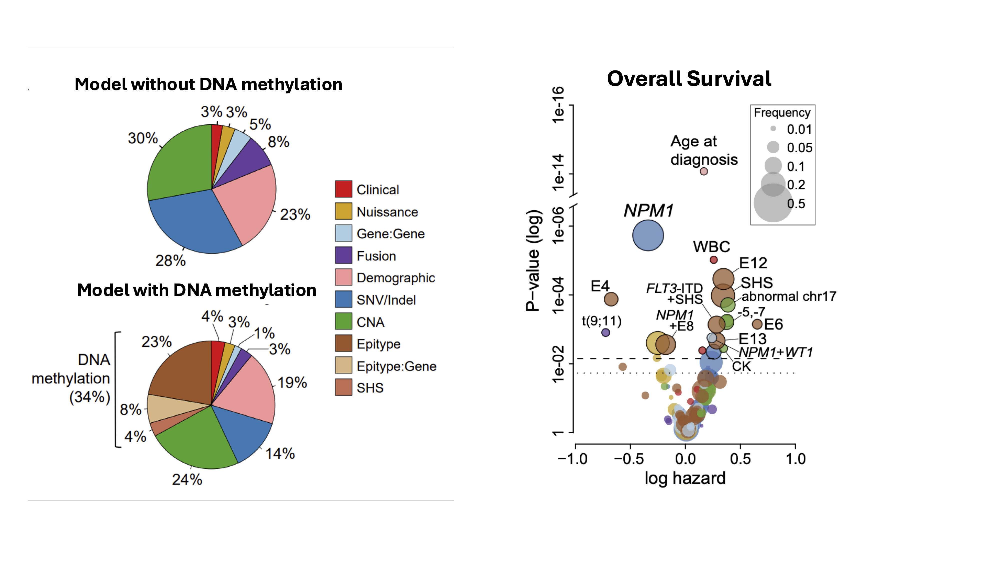
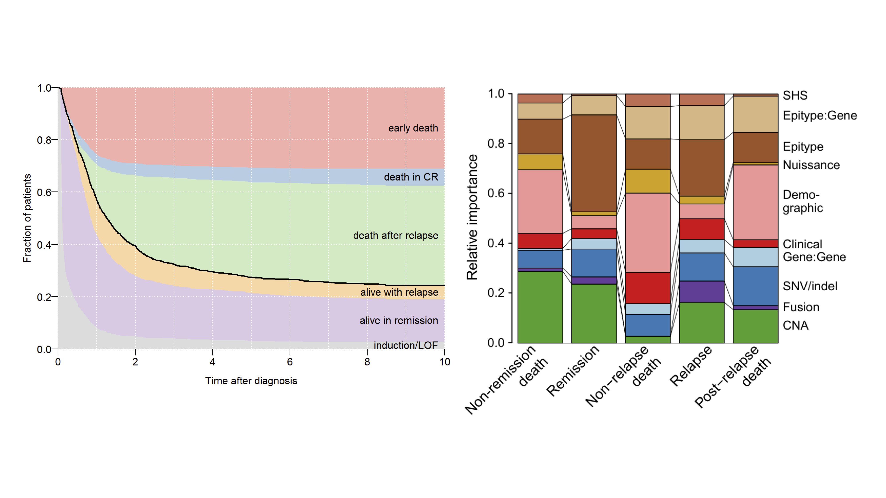

# Multistage Random-Effects Survival Modeling in AML

## Overview

This project implements a **multistage random-effects (RFX) machine learning framework** to quantify the prognostic contribution of **DNA methylation** relative to genetic, cytogenetic, clinical, and demographic factors in Acute Myeloid Leukemia (AML).
The framework is based on the multistage random-effects survival model developed by **Gerstung et al.**, adapted and extended to incorporate incorporate DNA methylation epitypes and epitype-mutation interaction terms.

---

## Data Integrated

The model integrates multiple modalities of AML patient data:

* Recurrent genetic alterations
* Cytogenetics
* Clinical variables
* Demographics
* Treatment protocol (nuisance variables)
* DNA methylation epitypes
* Epitype–mutation interaction terms

---

## Modeling Components

* Random-effects structure by feature class
* Time-dependent survival modeling
* Bootstrap-based variance estimation
* Wald testing with FDR correction
* Variance component decomposition
* Multistage state-transition modeling

---

# Main Results: 

## Key Results

Previously in our publication, we show how AML patients can be divided into 13 subtypes/epitypes according to their global DNA methylation patterns. In order to assess the impact of DNA methylation among other prognostic markers, we used multistage random effects (RFX)  model combining recurrent genetic alterations with clinical and demographic prognostic markers and outperforming ELN genetic-risk classification in the Alliance AML cohort. Adding Epitypes and Epitypes:Genetic terms explained a substantial fraction of inter-patient variability (aroune 30%), exceeding reliance on genetic predictors. Using Overall Survival model, the top significant predictors were mostly epitype-derived.  

<p align="center">
  
</p>


### Creating Multi-stage Model 

To create multi-stage model, we defined 6 states that an AML patient can go through: 
State 1: Diagnosis (starting point)
State 2: Complete Remission (CR)
State 3: Relapse
State 4: Early Death (died without achieving CR)
State 5: Non-Relapse Death (died in remission)
State 6: Post-Relapse Death

States 4, 5, and 6 are end fates. Thus, the allowed transitions are:
1 → 2 (achieved CR)       or   1 → 4 (died early, never got CR)
2 → 3 (relapsed)          or   2 → 5 (died in remission)
3 → 6 (died after relapse)

We next built the transition data: 

```{r
d <- sapply(1:nrow(os_new), function(i) {
  t <- c(as.numeric(os_new[i, c("time_to_cr", "time_to_relapse", "time_to_fu")]))
  o <- order(t, na.last = NA)       # sort whichever events happened by time
  stages <- c(1:3, 0)
  r <- stages[c(1, o + 1)]         # map ordered events to state numbers
  if (os_new$sstat[i])
    r[length(r)] <- r[length(r)-1] + 3   # if patient died, shift final state to a death state
  ...
})
```

where for each patient you take their three possible event times (CR, relapse, last follow-up), sort them chronologically, and convert that sequence into a series of rows in the format (id, stop_time, from_state, to_state). The + 3 shift is important as: states 1→3 are "alive" states, and 4→6 are their corresponding death states. Adding 3 to the last state converts "was in state X" to "died from state X."

We nexted created the graph structure and fit the non-parametric Multi-State Model

```{r
nodes <- as.character(1:6)
edges <- list(
  `1` = list(edges = c("2", "4")),
  `2` = list(edges = c("3", "5")),
  `3` = list(edges = "6"),
  `4` = list(edges = NULL),   # absorbing
  `5` = list(edges = NULL),   # absorbing
  `6` = list(edges = NULL)    # absorbing
)
struct <- new("graphNEL", nodes = nodes, edgeL = edges, edgemode = "directed")
msurv <- msSurv(d, struct, bs = FALSE)
```


Multi-State Disease Trajectory and Transition-Specific Variance Components:

AML patients transition through a directed sequence of clinical states from diagnosis through remission, relapse, and death each governed by different biology. We modeled this explicitly using a 6 state Markov structure fit with msSurv and five separate CoxRFX random effects models, one per transition. The left panel shows the population level state occupation probabilities over time. The right panel shows that the dominant predictors shift across transitions where CNA drives early death, epigenetic features dominate remission and post-relapse outcomes, and demographics (age) becomes critical for non-relapse death. Epitypes have considerable weight across all clinical endpoints. 

<p align="center">
  
</p>

Increasing oncogenic burden is associated with progressively worse overall survival, demonstrating robust clinical risk stratification captured by the model.

---

### Variance Contribution Across Feature Classes
<p align="center">
  
</p>

DNA methylation features explain a substantial fraction of inter-patient variability in survival outcomes, comparable to or exceeding traditional genetic and clinical predictors.

---

### Feature-Level Associations with Outcome
<p align="center">
  
</p>

Epitypes, SHS, and epitype–mutation interactions emerge as among the most significant predictors of outcome, highlighting biologically interpretable drivers.

---

### Multistage Disease Trajectories
<p align="center">
  
</p>

Multistate modeling captures dynamic transitions between remission, relapse, and death over time following AML diagnosis.


